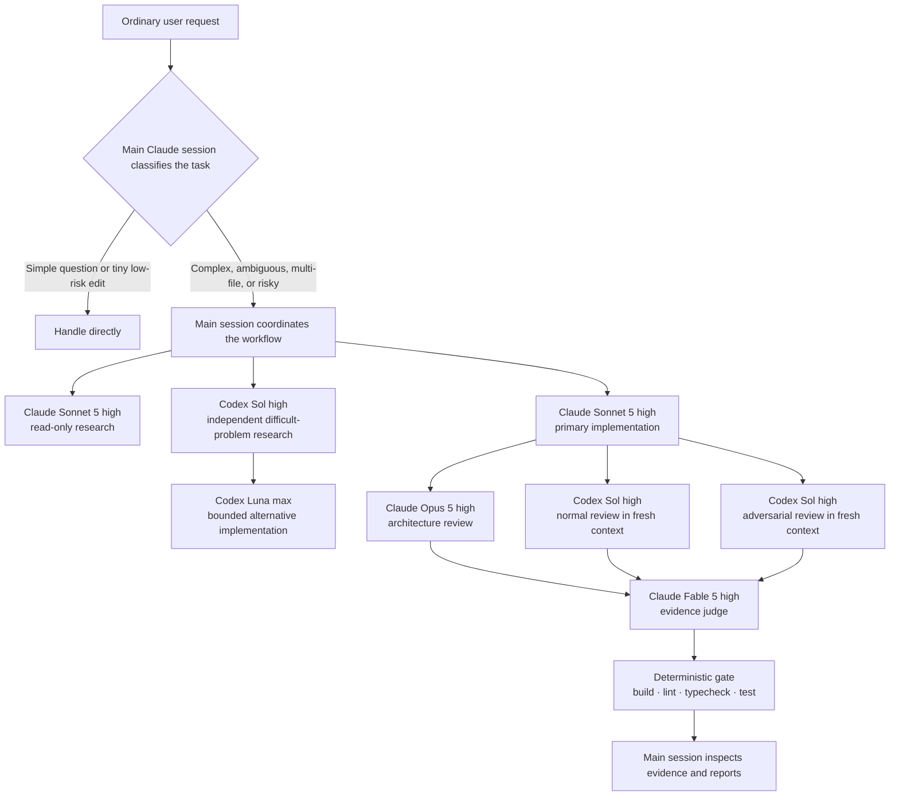
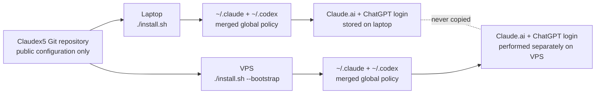

# Claudex5 Engineering Harness

A global, installable orchestration policy for using Claude Code and OpenAI Codex together—without copying credentials or replacing your existing configuration.

> **Unofficial community project.** This repository is not affiliated with, endorsed by, or maintained by Anthropic or OpenAI.

[한국어 사용 안내](docs/usage-ko.md) · [Security policy](SECURITY.md) · [Contributing](CONTRIBUTING.md)

## What this is

Claudex5 installs **global instructions and global agent definitions**, not a `SKILL.md` skill. After installation:

- `~/.claude/CLAUDE.md` tells the main Claude Code session how to route ordinary requests.
- `~/.codex/AGENTS.md` gives Codex the same global working policy.
- `~/.claude/agents/harness-*` provides Claude role definitions in fresh contexts.
- `~/.codex/agents/harness-*` provides Codex model and reasoning configurations.
- Existing hooks, plugins, project trust entries, MCP servers, status lines, and user instructions remain in place.

Project-level `CLAUDE.md` and `AGENTS.md` files can add more specific rules and take precedence where appropriate.

## Architecture

You normally speak to Claude as usual. The global policy keeps small tasks direct and activates the larger review chain only when complexity or risk justifies it.



The main session—not a nested subagent—is the coordinator because Claude Code subagents cannot spawn other subagents. Review agents do not edit the code they review.

## Role matrix

`Reasoning effort` controls how much computation a model may spend on difficult reasoning. Higher settings generally improve hard decisions but can cost more time and usage.

| Role | Model / effort | When it runs | Automatic or manual |
|---|---|---|---|
| Main coordinator | Current Claude session; Fable 5 high recommended | Owns requirements, routing, integration, and final verification | Automatic for complex work |
| Researcher | Claude Sonnet 5 / high | Repository exploration before unclear implementation | Automatic when useful |
| Implementer | Claude Sonnet 5 / high | Primary scoped implementation | Automatic |
| Implementer escalation | Claude Opus 5 / high | Sonnet is demonstrably blocked or a change is unusually risky | Manual fallback |
| Independent research | Codex Sol / high | Alternative diagnosis or difficult-problem analysis | Automatic when materially useful |
| Alternative implementation | Codex Luna / max | Only when files, behavior, and acceptance criteria are bounded | Explicit routing recommended |
| Architecture reviewer | Claude Opus 5 / high | Meaningful structural changes | Automatic for complex work |
| Normal reviewer | Codex Sol / high | Correctness and regression review | Automatic for meaningful changes |
| Adversarial reviewer | Codex Sol / high | Failure modes, trust boundaries, races, rollback | Risk-based |
| Judge | Claude Fable 5 / high | Reconciles review evidence | Automatic for complex/release work |
| Judge fallback | Claude Opus 5 / high | Fable unavailable or evidence conflict is high risk | Manual fallback |
| Quality gate | Ordinary project tools | Build, lint, typecheck, and test | Always before completion when available |

Model availability depends on your Claude/ChatGPT plan and installed CLI versions. Fallbacks are intentionally manual: silently switching to a more expensive or behaviorally different model would hide an important decision.

## Requirements

- macOS, Debian, or Ubuntu
- Bash
- Git
- Python 3.11+
- Node.js 18.18+ for the official Codex Claude Code plugin
- A Claude Code-capable Claude account
- A ChatGPT subscription or OpenAI API access supported by Codex

The recommended authentication mode is a Claude.ai subscription for Claude Code and ChatGPT login for Codex. API keys are not required by this repository.

## Quick start

### Existing laptop or VPS

If Claude Code and Codex are already installed:

```bash
git clone https://github.com/woongjaejung/claudex5-engineering-harness.git
cd claudex5-engineering-harness
./install.sh
./verify.sh --strict
```

The installer backs up each file it may change, creates namespaced agent links, merges managed instruction blocks, enables the official OpenAI Codex Claude Code plugin, and runs verification.

### Fresh Debian or Ubuntu VPS

```bash
git clone https://github.com/woongjaejung/claudex5-engineering-harness.git
cd claudex5-engineering-harness
./install.sh --bootstrap
```

Then authenticate once on that VPS:

```bash
claude
codex login --device-auth
./verify.sh --strict
```

`--bootstrap` installs missing prerequisites from official distribution sources. Claude Code and Codex versions are pinned in the script for reproducibility; update the repository before bootstrapping a new server. The upstream Claude installer, npm registry, and plugin marketplace remain external supply-chain trust boundaries, so review `bootstrap-vps.sh` before running it on a sensitive host. It does **not** transfer laptop credentials.



## Everyday use

In most cases, do nothing special:

```bash
cd /path/to/your-project
claude
```

Then ask naturally:

```text
이 로그인 기능을 구현하고 테스트해줘.
```

For a complex request, the global instructions tell the main session to investigate, implement, use independent reviews when warranted, and run deterministic checks. A small question or one-line edit stays direct.

Good prompts still improve routing because they provide an outcome and constraints:

```text
결제 재시도 로직을 구현해줘. 기존 API 호환성을 유지하고,
동시 요청과 부분 실패를 검토한 뒤 테스트 결과까지 알려줘.
```

## Explicit role calls

Role names are escape hatches when you want exact routing; they are not required for normal use.

### Force the Claude orchestration agent as the main session

```bash
claude --agent harness-orchestrator
```

Or ask inside an existing session:

```text
harness-researcher로 현재 인증 흐름을 읽기 전용 조사한 뒤,
harness-implementer에게 명확한 파일 범위와 완료 조건을 넘겨줘.
```

### Manual Claude fallbacks

```bash
claude --agent harness-orchestrator-opus
claude --agent harness-implementer-opus
claude --agent harness-judge-opus
```

Use these only when Fable/Sonnet is unavailable, a prior role returned evidence of a blocker, or the decision has unusually high impact.

### Independent Codex work from Claude Code

Inside Claude Code, use the official plugin commands:

```text
/codex:rescue --fresh --model gpt-5.6-sol --effort high 이 장애 원인과 대안을 독립적으로 조사해줘
/codex:review --background
/codex:adversarial-review --background 인증 우회, 데이터 손실, 경쟁 조건, 롤백 실패를 집중 검토해줘
/codex:status
/codex:result
```

`--fresh` starts an independent Codex context instead of inheriting conclusions from a prior rescue thread.

The official plugin 1.0.0 accepts reasoning effort only through `xhigh`. For an exact Luna Max run, invoke Codex directly from a trusted project directory and give it a tightly bounded task:

```bash
codex exec --ephemeral --model gpt-5.6-luna \
  -c 'model_reasoning_effort="max"' \
  --sandbox workspace-write \
  "이 파일 범위와 완료 조건 안에서만 대안 구현하고 지정한 테스트를 실행해줘."
```

Use `--sandbox read-only` instead when the task is research or review. Do not describe a plugin `xhigh` run as `max`.

### Direct Codex use

Run `codex` normally. The global `~/.codex/AGENTS.md` routing policy and registered `harness_*` agents are available. You can explicitly request one:

```text
Use harness_sol_adversarial_review to review the current change without editing files.
```

## Automatic behavior and manual boundaries

Automatic:

- Task complexity classification
- Read-only research before unclear implementation
- Sonnet implementation for scoped work
- Independent review for meaningful changes
- Repository build/lint/typecheck/test discovery and execution
- Preservation and inspection of delegated results

Manual or explicitly confirmed:

- Fable → Opus fallback
- Sonnet implementer → Opus implementer escalation
- Luna alternative implementation when the task is not already tightly bounded
- `--harden`, because it changes pre-existing trust and warning settings
- Subscription login on every new machine

## Project template

Global instructions already apply everywhere. Use `project-template/` only when a repository should also carry shared, project-specific instructions:

```bash
cp project-template/CLAUDE.md /path/to/project/CLAUDE.md
cp project-template/AGENTS.md /path/to/project/AGENTS.md
mkdir -p /path/to/project/scripts
cp project-template/scripts/quality-gate.sh /path/to/project/scripts/quality-gate.sh
```

Edit the placeholders with the project's actual runtime, protected paths, ownership boundaries, and required commands.

## Safe merge and backups

Before every install or uninstall, the four possible configuration targets are backed up under:

```text
~/.local/state/claudex5-engineering-harness/backups/<UTC timestamp>-<process id>/
```

Installation is repeatable: running `./install.sh` again updates the managed blocks and link targets without duplicating them. A foreign file or symlink using a `harness-*` managed name stops installation instead of being overwritten.

The default installer preserves existing risky settings and prints warnings. To explicitly harden the known settings:

```bash
./install.sh --harden
```

Currently this disables Claude's dangerous-mode warning bypass and removes only Codex's exact root `/` trust entry. Named project trust entries remain.

## Update

```bash
cd /path/to/claudex5-engineering-harness
git pull --ff-only
./install.sh
./verify.sh --strict
```

Agent definitions update immediately through their links; rerunning the installer refreshes managed instruction and configuration blocks.

## Uninstall

```bash
cd /path/to/claudex5-engineering-harness
./uninstall.sh
```

This removes only Claudex5-managed links, instruction blocks, and Codex agent tables. It leaves Claude Code, Codex, the official plugin, authentication, user hooks, and unrelated configuration installed. The uninstaller creates a backup first.

## Security

The repository never copies or commits:

- `~/.codex/auth.json`
- Claude account state such as `~/.claude/.claude.json`
- credentials, tokens, cookies, session history, logs, or SQLite state
- values of API credential environment variables

`.gitignore` is only a convenience, not the security boundary. `verify.sh` scans tracked and untracked Git candidates for forbidden credential filenames and likely secret formats. It reports file paths and rule IDs, never the matched value.

Run this immediately before pushing:

```bash
./verify.sh --strict
git status --short
git diff --cached
```

See [SECURITY.md](SECURITY.md) for private vulnerability reporting.

## Troubleshooting

### A model is unavailable

Confirm current models with Claude's `/model` picker or Codex model selection. Use the corresponding Opus fallback agent manually. Do not rename agent files just to hide an unavailable model; model support depends on account and CLI version.

### Claude does not show a newly installed agent

Restart Claude Code or run `/agents` to reload agent definitions. Then check:

```bash
./verify.sh
```

### `/codex:*` commands are missing or not ready

Inside Claude Code:

```text
/reload-plugins
/codex:setup
```

From the shell, confirm both runtimes:

```bash
node --version
codex login status
./verify.sh --strict
```

### Authentication is missing on a VPS

```bash
claude
codex login --device-auth
```

Authentication is intentionally not repaired by copying laptop files.

### Installation reports a managed-name collision

Inspect the exact path printed by the installer. If it is your file, rename it and rerun. If it is a stale Claudex5 link from a moved clone, remove only that printed stale symlink, then run `./install.sh` from the new clone. Do not recursively delete `~/.claude` or `~/.codex`.

### Restore a backup

Each backup contains `manifest.tsv` and only the configuration files that installation could change. Copy the required file from the reported backup directory to the same relative location, preserving permissions. Do not restore an entire `~/.claude` or `~/.codex` directory over current state.

## Development

```bash
python3 -m unittest discover -s tests -v
bash tests/test_install.sh
bash tests/test_bootstrap.sh
bash tests/test_verify.sh
./verify.sh --secrets-only
```

See [CONTRIBUTING.md](CONTRIBUTING.md) before opening a pull request.

## License

[MIT](LICENSE) © 2026 Woongjae Jung
