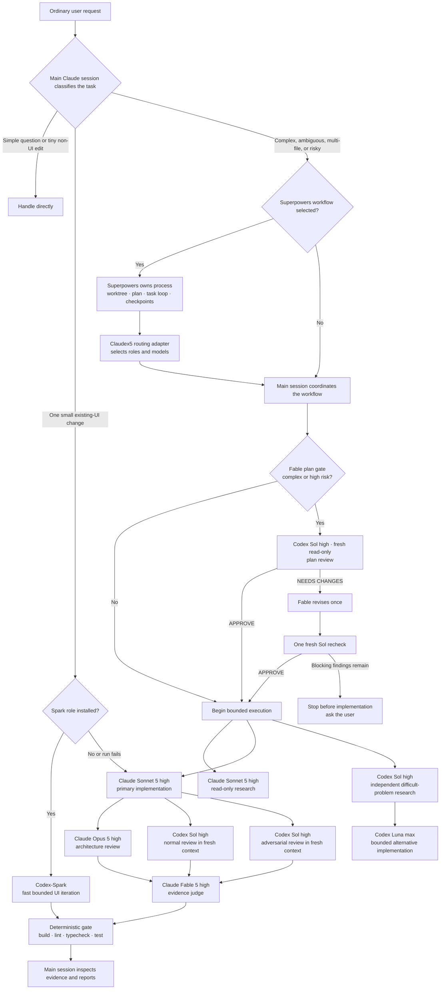
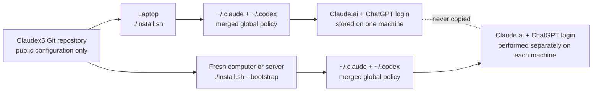
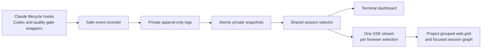

# Claudex5 Engineering Harness

A global, installable orchestration policy for using Claude Code and OpenAI Codex together—without copying credentials or replacing your existing configuration.

> **Unofficial community project.** This repository is not affiliated with, endorsed by, or maintained by Anthropic or OpenAI.

[Korean usage guide](docs/usage-ko.md) · [Security policy](SECURITY.md) · [Contributing](CONTRIBUTING.md)

## What this is

Claudex5 is primarily **global instructions and global agent definitions**. It also installs one narrow `SKILL.md` compatibility adapter so Superpowers can keep its development process while Claudex5 selects the roles and models. The adapter is not a replacement for the global policy. After installation:

- `~/.claude/CLAUDE.md` tells the main Claude Code session how to route ordinary requests.
- `~/.codex/AGENTS.md` gives Codex the same global working policy.
- `~/.claude/agents/harness-*` provides Claude role definitions in fresh contexts.
- `~/.claude/skills/claudex5-subagent-routing/SKILL.md` bridges Superpowers execution workflows to those roles.
- `~/.claude/statuslines/claudex5-subagent-models.py` shows each Claudex5 Claude role's configured model and effort in the subagent panel.
- `~/.codex/agents/harness-*` provides Codex model and reasoning configurations.
- Existing hooks, plugins, project trust entries, MCP servers, status lines, and user instructions remain in place.

Project-level `CLAUDE.md` and `AGENTS.md` files can add more specific rules and take precedence where appropriate.

## Architecture

You normally speak to Claude as usual. The global policy keeps small tasks direct and activates the larger review chain only when complexity or risk justifies it.



The main session—not a nested subagent—is the coordinator because Claude Code subagents cannot spawn other subagents. Review agents do not edit the code they review.

Superpowers and Claudex5 therefore complement each other:

- Superpowers owns workflow mechanics: planning, worktrees, the task ledger, task-by-task execution, checkpoints, and review gates.
- Claudex5 owns routing: researcher, implementer, optional Spark, Opus escalation, fresh Codex reviews, judge, and deterministic verification.
- A competing routing plugin such as `fable-advisor` can replace this matrix. Verification detects it but never disables it automatically.

## Role matrix

`Reasoning effort` controls how much computation a model may spend on difficult reasoning. Higher settings generally improve hard decisions but can cost more time and usage.

| Role | Model / effort | When it runs | Automatic or manual |
|---|---|---|---|
| Main coordinator | Current Claude session; Fable 5 high recommended | Owns requirements, routing, integration, and final verification | Automatic for complex work |
| Plan reviewer | Codex Sol / high, fresh read-only context | Before implementation when a plan is complex or high risk | Automatic and conditional; one recheck maximum |
| Researcher | Claude Sonnet 5 / high | Repository exploration before unclear implementation | Automatic when useful |
| Implementer | Claude Sonnet 5 / high | Primary scoped implementation | Automatic |
| Fast UI iteration | Codex-Spark | One small change to an existing UI, only when account access is confirmed | Automatic and conditional; Sonnet fallback |
| Implementer escalation | Claude Opus 5 / high | Sonnet is demonstrably blocked or a change is unusually risky | Manual fallback |
| Independent research | Codex Sol / high | Alternative diagnosis or difficult-problem analysis | Automatic when materially useful |
| Alternative implementation | Codex Luna / max | Only when files, behavior, and acceptance criteria are bounded | Explicit routing recommended |
| Architecture reviewer | Claude Opus 5 / high | Meaningful structural changes | Automatic for complex work |
| Normal reviewer | Codex Sol / high | Correctness and regression review | Automatic for meaningful changes |
| Adversarial reviewer | Codex Sol / high | Failure modes, trust boundaries, races, rollback | Risk-based |
| Judge | Claude Fable 5 / high | Reconciles review evidence | Automatic for complex/release work |
| Judge fallback | Claude Opus 5 / high | Fable unavailable or evidence conflict is high risk | Manual fallback |
| Quality gate | Ordinary project tools | Build, lint, typecheck, and test | Always before completion when available |

Model availability depends on your Claude/ChatGPT plan and installed CLI versions. Opus fallbacks are intentionally manual because they change cost and behavior. Spark is the exception: if it is unavailable, the bounded UI route falls back to Sonnet automatically.

During the current research preview, [OpenAI documents Codex-Spark as a ChatGPT Pro feature](https://learn.chatgpt.com/docs/agent-configuration/speed). The installer does not guess the plan name. It calls the official App Server [`model/list`](https://learn.chatgpt.com/docs/app-server) method and enables Spark only when the authenticated account exposes the exact `gpt-5.3-codex-spark` model. This check starts no model turn and stores no account or model-catalog data.

## Requirements

- macOS, Debian, or Ubuntu
- Bash
- Git
- Python 3.11+
- Node.js 18.18+ for the official Codex Claude Code plugin
- A Claude Code-capable Claude account
- A ChatGPT subscription or OpenAI API access supported by Codex

The recommended authentication mode is a Claude.ai subscription for Claude Code and ChatGPT login for Codex. API keys are not required by this repository.

## Quick start

### Existing computer or server

If Claude Code and Codex are already installed:

```bash
git clone https://github.com/woongjaejung/claudex5-engineering-harness.git
cd claudex5-engineering-harness
./install.sh
./verify.sh --strict
```

The installer backs up each file it may change, creates namespaced agent links, merges managed instruction blocks, enables the official OpenAI Codex Claude Code plugin, and runs verification.

### Fresh Debian or Ubuntu computer or server

```bash
git clone https://github.com/woongjaejung/claudex5-engineering-harness.git
cd claudex5-engineering-harness
./install.sh --bootstrap
```

Then authenticate once on that machine:

```bash
claude
codex login --device-auth
./install.sh
./verify.sh --strict
```

The second install is intentional: the bootstrap run cannot enable account-gated Spark before Codex authentication exists.

`--bootstrap` installs missing prerequisites from official distribution sources. Claude Code and Codex versions are pinned in the script for reproducibility; update the repository before bootstrapping a new machine. The upstream Claude installer, npm registry, and plugin marketplace remain external supply-chain trust boundaries, so review `bootstrap-system.sh` before running it on a sensitive system. It does **not** transfer credentials from another machine.



## Everyday use

In most cases, do nothing special:

```bash
cd /path/to/your-project
claude
```

Then ask naturally:

```text
Implement this login feature and test it.
```

For a complex request, the global instructions tell the main session to investigate, implement, use independent reviews when warranted, and run deterministic checks. A small question or one-line edit stays direct.

If Superpowers chooses `subagent-driven-development` or `executing-plans`, the main session loads the Claudex5 routing adapter automatically. Superpowers continues its normal task loop, but task implementers and reviewers come from the Claudex5 matrix. You do not need to name the adapter or answer a second execution-mode question.

Before implementation, Fable keeps ownership of the plan and conditionally asks a fresh, read-only Codex Sol high context to validate it. The gate runs when any of these conditions apply:

- the plan crosses multiple modules or services;
- it affects authentication, authorization, security, data migration, or destructive state;
- rollback is difficult, the architecture changes materially, or operational risk is high;
- the problem is ambiguous or has multiple viable approaches with meaningful trade-offs; or
- the plan contains five or more executable tasks.

Routine simple plans skip the gate. The reviewer returns `APPROVE` or `NEEDS CHANGES`. Fable may revise once and request one fresh recheck. If blocking findings remain, the harness stops before implementation and asks you instead of looping or silently approving the plan. In a task UI, look for `[Codex Sol · high] Plan review`.

Running Claudex5 Claude subagents show their role, configured model, effort, and task description:

```text
harness-researcher [Claude Sonnet 5 · high] · Trace authentication flow
harness-implementer [Claude Sonnet 5 · high] · Implement Task 1
harness-architecture-reviewer [Claude Opus 5 · high] · Review module boundaries
harness-judge [Claude Fable 5 · high] · Reconcile review evidence
```

Open `/agents` to inspect running subagents or `/tasks` to inspect background work in the current Claude Code session. The renderer overrides only exact `harness-*` Claudex5 roles; Superpowers and third-party agents keep Claude Code's default rows. Official Codex plugin work is not a Claude custom subagent, so Claudex5 instead prefixes its visible task description with `[Codex Sol · high]`, `[Codex Luna · max]`, or `[Codex-Spark]` when that interface provides a description.

Good prompts still improve routing because they provide an outcome and constraints:

```text
Implement the payment retry logic while preserving API compatibility.
Review concurrent requests and partial failures, then report the test results.
```

A narrow UI request naturally qualifies for Spark when it is installed:

```text
In the existing settings dialog, reduce the Save button's top spacing to match the other form actions.
Do not change behavior or data flow, and verify the result in the browser.
```

If Spark is not available on that computer or server, the same request continues with the Sonnet implementer. Ordinary automatic routing does not stop merely because the optional model is absent.

## Live node-and-edge dashboard

New Claude Code sessions are collected automatically after installation. Collection is passive: it does not open another terminal or browser and does not replace `statusLine`, `subagentStatusLine`, `/agents`, or `/tasks`.



List retained sessions, then open a continuously updating terminal graph in a second terminal:

```bash
claudex5 sessions
claudex5 dashboard
```

`dashboard` first uses one running session from the current project directory. If none is running, it uses that directory's single retained session. In an interactive terminal, any remaining ambiguity opens the selector; `--select` always opens it. In a non-interactive command (including `--once`), ambiguity is an error rather than a prompt, so select deterministically with `--session-id` or `--all`.

```bash
claudex5 dashboard --select
claudex5 dashboard --session-id session-123
claudex5 dashboard --all
```

Print one selected snapshot, or open the local web graph:

```bash
claudex5 dashboard --once
claudex5 dashboard --web
```

`--all` groups the web grid by project directory, keeps running sessions visible, and places the most recent completed session for each project behind a collapsed “Completed sessions” disclosure. Select a card to focus its graph and its safe task details. The graph shows task, agent, review, judge, and quality-gate nodes; dependency and parent-child edges; current state; and known role/model/effort. Task subjects and safe descriptions are shown separately; descriptions are bounded to 160 characters. Durations use lifecycle timestamps and say that a duration is unknown when timestamps are missing or unreliable. Automatic Codex roles use `claudex5 codex-run`, and project-template checks use `claudex5 gate-run`, so their real process exit states appear in the same graph. Manual `/codex:*` plugin calls remain supported but appear only when the plugin exposes enough lifecycle information.

The browser keeps one Server-Sent Events (SSE) stream for its current selection. The server sends an initial snapshot, then only changed revisions, plus keepalive comments. If SSE disconnects or is unavailable, the browser retries the stream and uses snapshot polling every 5 seconds until SSE is healthy again; stale responses are ignored after a selection changes.

The web server accepts only loopback hosts and defaults to `127.0.0.1:8765`. On a remote computer or server, keep it bound there and create an SSH (Secure Shell) tunnel from your local computer:

```bash
ssh -L 8765:127.0.0.1:8765 user@example-server
```

Then open `http://127.0.0.1:8765/` locally. No external assets or analytics are loaded. The recorder keeps only allowlisted, sanitized lifecycle metadata: logical identifiers, state, dependencies, known role/model/effort, task subjects, and descriptions limited to 160 characters. Its field-level allowlist does not collect raw or dedicated prompt, response content, `outputFile`, usage telemetry, transcript paths, code, command, tool-output, environment, authentication, or model-catalog fields. Subjects and descriptions are still free text supplied by a user or tool: do not put secrets, sensitive code, or commands in them. Known secret shapes receive best-effort redaction, not a complete data-loss-prevention guarantee. Sanitized lifecycle state is stored with private permissions under `${XDG_STATE_HOME:-~/.local/state}/claudex5-engineering-harness/runs` and remains on that machine.

Inspect or remove runtime history:

```bash
claudex5 status --json
claudex5 clean --days 7
claudex5 clean --all
```

Uninstall preserves this history by default. Use `claudex5 clean --all` before uninstalling only when you intentionally want to delete it. If the dashboard is empty, start a new Claude Code session after installation. If a command reports ambiguous dashboard selection, rerun it with `--session-id`, `--all`, or (only in an interactive terminal) `--select`. If the web port is busy, choose another loopback port with `claudex5 dashboard --web --port 8766`. A reconnecting web status is safe: the five-second polling fallback keeps the display current while SSE reconnects.

## Explicit role calls

Role names are escape hatches when you want exact routing; they are not required for normal use.

### Force the Claude orchestration agent as the main session

```bash
claude --agent harness-orchestrator
```

Or ask inside an existing session:

```text
Use harness-researcher to inspect the current authentication flow without making changes,
then give harness-implementer explicit file boundaries and acceptance criteria.
```

### Manual Claude fallbacks

```bash
claude --agent harness-orchestrator-opus
claude --agent harness-implementer-opus
claude --agent harness-judge-opus
```

Use these only when Fable/Sonnet is unavailable, a prior role returned evidence of a blocker, or the decision has unusually high impact.

### Independent Codex work from Claude Code

For an automatically managed, graph-visible invocation, place the prompt in a temporary file outside the repository and use a fixed role:

```bash
claudex5 codex-run \
  --role harness_sol_review \
  --label "[Codex Sol · high] Independent review" \
  --sandbox read-only \
  --prompt-file /path/to/review-prompt.txt
```

Available role identifiers are `harness_sol_plan_review`, `harness_sol_research`, `harness_luna_implementation`, `harness_sol_review`, `harness_sol_adversarial_review`, and conditionally `harness_spark_ui_iteration`. The wrapper fixes the role's model and effort, passes the prompt only through standard input, records lifecycle metadata, forwards termination signals, and returns the child process status.

Inside Claude Code, use the official plugin commands:

```text
/codex:rescue --fresh --model gpt-5.6-sol --effort high [Codex Sol · high] Plan review: Review the complete implementation plan read-only and return APPROVE or NEEDS CHANGES.
/codex:rescue --fresh --model gpt-5.6-sol --effort high Independently investigate the cause of this failure and possible alternatives.
/codex:review --background
/codex:adversarial-review --background Focus on authentication bypasses, data loss, race conditions, and rollback failures.
/codex:status
/codex:result
```

`--fresh` starts an independent Codex context instead of inheriting conclusions from a prior rescue thread. Manual plugin commands are best-effort observable in the live graph.

When the installer reports that Spark is enabled, you can request its narrow route explicitly:

```text
/codex:rescue --fresh --model spark Change only the existing profile card spacing, preserve behavior, and verify it in the browser.
```

Or, in direct Codex use:

```text
Use harness_spark_ui_iteration for this one bounded change to the existing UI.
```

Do not force Spark when `~/.codex/agents/harness-spark-ui-iteration.toml` is absent. Rerun `./install.sh` after authenticating or changing subscription access; the installer will reconcile the role automatically.

The official plugin 1.0.0 accepts reasoning effort only through `xhigh`. For an exact Luna Max run, invoke Codex directly from a trusted project directory and give it a tightly bounded task:

```bash
codex exec --ephemeral --model gpt-5.6-luna \
  -c 'model_reasoning_effort="max"' \
  --sandbox workspace-write \
  "Implement an alternative only within these file boundaries and acceptance criteria, then run the specified tests."
```

Use `--sandbox read-only` instead when the task is research or review. Do not describe a plugin `xhigh` run as `max`.

### Direct Codex use

Run `codex` normally. The global `~/.codex/AGENTS.md` routing policy and registered `harness_*` agents are available. You can explicitly request one:

```text
Use harness_sol_plan_review in a fresh read-only context to validate this implementation plan before any code changes.
Use harness_sol_adversarial_review to review the current change without editing files.
```

## Automatic behavior and manual boundaries

Automatic:

- Task complexity classification
- Conditional fresh Codex Sol plan review before complex or high-risk implementation
- Account-aware Spark routing for one small existing-UI change, with automatic Sonnet fallback
- Read-only research before unclear implementation
- Sonnet implementation for scoped work
- Independent review for meaningful changes
- Repository build/lint/typecheck/test discovery and execution
- Preservation and inspection of delegated results
- Superpowers compatibility routing when `subagent-driven-development` or `executing-plans` is selected

Manual or explicitly confirmed:

- Proceeding with a high-risk plan when independent Sol plan review is unavailable or remains blocked after one recheck
- Fable → Opus fallback
- Sonnet implementer → Opus implementer escalation
- Luna alternative implementation when the task is not already tightly bounded
- `--harden`, because it changes pre-existing trust and warning settings
- Subscription login on every new machine

## Project template

Global instructions already apply everywhere. Use `project-template/` only when a repository should also carry shared, project-specific instructions:

```bash
cp project-template/CLAUDE.md /path/to/project/CLAUDE.md
cp project-template/AGENTS.md /path/to/project/AGENTS.md
mkdir -p /path/to/project/scripts
cp project-template/scripts/quality-gate.sh /path/to/project/scripts/quality-gate.sh
```

Edit the placeholders with the project's actual runtime, protected paths, ownership boundaries, and required commands.

## Safe merge and backups

Before every install or uninstall, the four possible configuration targets are backed up under:

```text
~/.local/state/claudex5-engineering-harness/backups/<UTC timestamp>-<process id>/
```

Installation is repeatable: running `./install.sh` again updates the managed blocks and link targets without duplicating them. A foreign file or symlink using a `harness-*` managed name stops installation instead of being overwritten.

The default installer preserves existing risky settings and prints warnings. To explicitly harden the known settings:

```bash
./install.sh --harden
```

Currently this disables Claude's dangerous-mode warning bypass and removes only Codex's exact root `/` trust entry. Named project trust entries remain.

## Update

```bash
cd /path/to/claudex5-engineering-harness
git pull --ff-only && ./install.sh && ./verify.sh --strict
```

Linked agent definitions, the model-row renderer, the `claudex5` command, and the hook update immediately. Rerunning the installer refreshes managed instructions and settings hooks, then reconciles the account-gated Spark role on that machine.

## Uninstall

```bash
cd /path/to/claudex5-engineering-harness
./uninstall.sh
```

This removes only Claudex5-managed links, instruction blocks, and Codex agent tables. It leaves Claude Code, Codex, the official plugin, authentication, user hooks, and unrelated configuration installed. The uninstaller creates a backup first.
The `subagentStatusLine` entry is removed only when it still points to the Claudex5 renderer; a foreign replacement is preserved.
Private dashboard history is preserved. Run `claudex5 clean --all` before uninstalling, or remove the reported state directory afterward, only when you intentionally want to delete it.

## Security

The repository never copies or commits:

- `~/.codex/auth.json`
- Claude account state such as `~/.claude/.claude.json`
- credentials, tokens, cookies, session history, logs, or SQLite state
- values of API credential environment variables
- model-list responses or subscription details

`.gitignore` is only a convenience, not the security boundary. `verify.sh` scans tracked and untracked Git candidates for forbidden credential filenames and likely secret formats. It reports file paths and rule IDs, never the matched value.

Run this immediately before pushing:

```bash
./verify.sh --strict
git status --short
git diff --cached
```

See [SECURITY.md](SECURITY.md) for private vulnerability reporting.

## Troubleshooting

### A model is unavailable

Confirm current models with Claude's `/model` picker or Codex model selection. Use the corresponding Opus fallback agent manually. Do not rename agent files just to hide an unavailable model; model support depends on account and CLI version.

For Spark specifically, authenticate Codex and reconcile the optional role:

```bash
codex login status
./install.sh
./verify.sh
```

`verify.sh` warns when current Spark access and the installed role disagree. A temporary network or authentication failure does not break installation; Sonnet remains the fallback. If access is later restored, rerun the installer.

If Codex Sol is unavailable during a plan review, the harness must disclose that the plan was not independently validated. A routine task may continue without the optional gate. For a high-risk plan, choose whether to wait for Sol, proceed without independent validation, or request a manual Opus review; the harness must not make that choice silently.

### Claude does not show a newly installed agent

Restart Claude Code or run `/agents` to reload agent definitions. Then check:

```bash
./verify.sh
```

### `/codex:*` commands are missing or not ready

Inside Claude Code:

```text
/reload-plugins
/codex:setup
```

From the shell, confirm both runtimes:

```bash
node --version
codex login status
./verify.sh --strict
```

### Another orchestration plugin replaces Claudex5 roles

Keep Superpowers enabled. It supplies workflow mechanics and is compatible with the installed adapter. Disable only the competing role router, then restart Claude Code:

```bash
claude plugin list
claude plugin disable fable-advisor@fable-advisor
./install.sh
./verify.sh --strict
```

If `claude plugin list` reports project or local scope instead of user scope, pass that exact scope explicitly, for example `--scope project`. Claudex5 never disables the plugin automatically. To opt into it for a particular task, explicitly name `fable-advisor` in that task; the adapter permits exact user-requested overrides.

### Claudex5 subagents do not show model labels

Run strict verification and inspect Claude's agent panel:

```bash
./install.sh
./verify.sh --strict
```

Then restart Claude Code and open `/agents`. If verification reports a foreign `subagentStatusLine`, Claudex5 has preserved an existing custom renderer instead of overwriting it. Decide which renderer you want, remove or merge that setting manually, and rerun the installer. The independent top-level `statusLine` setting does not conflict and remains unchanged.

### Authentication is missing on a computer or server

```bash
claude
codex login --device-auth
```

Authentication is intentionally not repaired by copying laptop files.

### Installation reports a managed-name collision

Inspect the exact path printed by the installer. If it is your file, rename it and rerun. If it is a stale Claudex5 link from a moved clone, remove only that printed stale symlink, then run `./install.sh` from the new clone. Do not recursively delete `~/.claude` or `~/.codex`.

### Restore a backup

Each backup contains `manifest.tsv` and only the configuration files that installation could change. Copy the required file from the reported backup directory to the same relative location, preserving permissions. Do not restore an entire `~/.claude` or `~/.codex` directory over current state.

## Development

```bash
python3.11 -m unittest discover -s tests -v
bash tests/test_install.sh
bash tests/test_bootstrap.sh
bash tests/test_verify.sh
./verify.sh --secrets-only
```

See [CONTRIBUTING.md](CONTRIBUTING.md) before opening a pull request.

## License

[MIT](LICENSE) © 2026 Woongjae Jung
