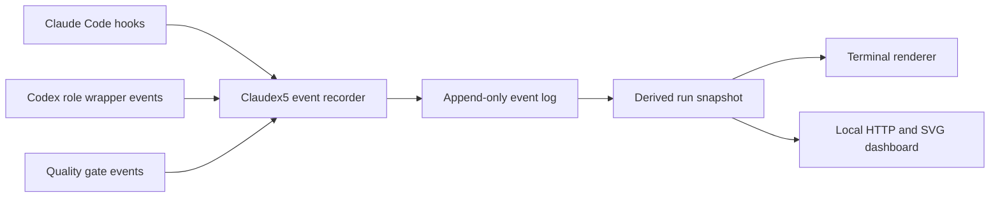

# Claudex5 Live Graph Dashboard Design

## Goal

Add an optional, zero-token observability layer that shows the active Claudex5 run as a live node-and-edge graph without replacing the user's existing Claude Code status line, subagent status line, hooks, or plugins.

The feature must work on macOS and fresh Debian or Ubuntu computers and servers after the normal harness installation. Runtime state remains local to each machine and is never committed or copied by the harness.

## User Experience

Installation starts event collection automatically for new Claude Code sessions. It does not open a terminal pane or browser automatically.

Users can open a terminal dashboard:

```bash
claudex5 dashboard
```

They can render one snapshot for scripts and troubleshooting:

```bash
claudex5 dashboard --once
```

They can open a local web dashboard:

```bash
claudex5 dashboard --web
```

The web server binds to `127.0.0.1:8765` by default. A server user reaches it through SSH port forwarding rather than exposing the port publicly.

Both views show:

- the current run and project;
- workflow, task, agent, review, judge, and deterministic-gate nodes;
- dependency and parent-child edges;
- waiting, running, passed, failed, blocked, skipped, and interrupted states;
- configured role, model, and reasoning effort when known;
- a sanitized, truncated task label;
- elapsed time and the next runnable nodes.

The terminal view uses compact Unicode and ANSI rendering, falls back to plain ASCII when color or Unicode is unsuitable, and changes to a list layout when the terminal is too narrow for a graph.

The browser view uses locally served HTML, CSS, and JavaScript with an inline SVG renderer. It must not load a JavaScript library, font, stylesheet, analytics script, or other asset from a content delivery network.

## Scope and Non-Goals

The first release includes:

1. automatic Claude Code lifecycle collection;
2. task and dependency collection from Claude's structured task tools;
3. Claudex5 Claude subagent lifecycle collection;
4. explicit lifecycle events for Codex roles and deterministic quality gates;
5. terminal and local-web rendering;
6. installer, verifier, uninstaller, documentation, and tests.

The first release does not:

- replace or compose the user's top-level `statusLine`;
- replace the existing Claudex5 `subagentStatusLine` model rows;
- automatically open tmux panes, terminal windows, or browsers;
- store prompts, code, tool output, agent responses, credentials, or transcript contents;
- modify Claude-managed agent-team state under `~/.claude/teams` or `~/.claude/tasks`;
- provide remote authentication or bind the dashboard to a public interface by default;
- promise perfect inference for third-party plugins that do not emit Claudex5 lifecycle events.

## Architecture



The implementation uses only the Python 3.11 standard library and POSIX shell facilities already required by the repository.

### Components

`scripts/live_graph/model.py`
: Defines the versioned event, node, edge, run-state, and snapshot contracts. It validates identifiers and state transitions and contains the pure event-reduction logic.

`scripts/live_graph/store.py`
: Resolves private state paths, appends events under an inter-process lock, atomically writes snapshots, selects the latest run, and removes expired runs.

`scripts/live_graph/record.py`
: Accepts Claude hook JSON on standard input or an explicit safe lifecycle event from the CLI. It allowlists fields, sanitizes labels, maps known Claudex5 roles to models, and returns quickly without blocking Claude on an observability failure.

`scripts/live_graph/terminal.py`
: Produces a width-aware node-and-edge view from a snapshot. It contains no collection or persistence logic.

`scripts/live_graph/web.py`
: Serves a fixed local dashboard and a read-only JSON snapshot endpoint. It refuses non-loopback binding unless the user supplies a separate explicit unsafe override; the initial public CLI does not expose that override.

`scripts/live_graph_cli.py`
: Provides the installed `claudex5` command and dispatches `dashboard`, `event`, `codex-run`, `gate-run`, `status`, and `clean` subcommands.

`claude/hooks/claudex5-live-graph.py`
: Stable symlink target used by Claude Code hook configuration. It locates the repository implementation and forwards standard input without shell interpolation.

## Runtime State

State lives at:

```text
${XDG_STATE_HOME:-~/.local/state}/claudex5-engineering-harness/runs/<session-id>/
├── events.jsonl
└── snapshot.json
```

The state root and run directories use mode `0700`. Files use mode `0600`. Writes use a lock and same-directory atomic replacement. The recorder rejects a symlink anywhere in the managed state path.

`events.jsonl` is the recovery source. `snapshot.json` is a derived cache for fast rendering. A malformed final event line is ignored during recovery; corruption earlier in the file marks the run degraded instead of silently inventing state.

At `SessionStart`, runs older than seven days are removed only when their canonical paths remain inside the Claudex5 state root. `claudex5 clean` performs the same bounded cleanup manually.

## Data Model

Every event contains:

```json
{
  "schema_version": 1,
  "event_id": "random UUID",
  "session_id": "Claude session identifier",
  "sequence": 12,
  "timestamp": "RFC 3339 UTC",
  "event_type": "node.started",
  "source": "claude-hook",
  "node_id": "agent:abc123",
  "payload": {}
}
```

The recorder assigns sequence numbers while holding the store lock. It never accepts a caller-supplied sequence number or filesystem path.

Node kinds are:

- `session`
- `workflow_stage`
- `task`
- `claude_agent`
- `codex_agent`
- `review`
- `judge`
- `quality_gate`

Node states are:

- `waiting`
- `running`
- `passed`
- `failed`
- `blocked`
- `skipped`
- `interrupted`

Terminal states never transition back to `running`. Duplicate start and stop events are idempotent. A stop without a recorded start creates a degraded node with the supplied final state so late hooks do not erase evidence.

Edges have a stable identifier derived from `source`, `target`, and `kind`. Edge kinds are:

- `contains`
- `depends_on`
- `dispatches`
- `reviews`
- `gates`

## Claude Code Event Collection

The installer safely appends namespaced command hooks to existing hook arrays and never removes or rewrites foreign hooks. Reinstallation detects the exact Claudex5 hook entry and does not duplicate it. Uninstallation removes only exact harness-owned entries.

Collected hook events are:

| Claude event | Recorded behavior |
|---|---|
| `SessionStart` | Create or resume the run and the root session node; perform bounded retention cleanup |
| `PreToolUse:TaskCreate` | Create a waiting task node and dependency edges from the allowlisted task fields |
| `PostToolUse:TaskUpdate` | Update task state from the structured tool result when a stable task identifier is available |
| `SubagentStart` | Create a running Claude-agent node using `agent_id` and `agent_type` |
| `SubagentStop` | Finish the matching node without reading `last_assistant_message` or the transcript |
| `Stop` | Record a non-terminal workflow checkpoint and the allowlisted status of background tasks, without treating the session as finished |
| `SessionEnd` | Finalize the run and close remaining running nodes as interrupted |

Hook failures are non-blocking. The hook writes a short error category to standard error, never echoes the input, and exits successfully unless invoked in its explicit self-test mode.

## Codex and Quality-Gate Events

Codex work is not always a Claude custom subagent, so automatic Claudex5 routes use a lifecycle-aware direct Codex wrapper:

```bash
claudex5 codex-run \
  --role harness_sol_plan_review \
  --label "Plan review" \
  --sandbox read-only \
  --prompt-file /path/to/plan-review-prompt.txt
```

The wrapper selects the role's fixed model and effort, starts an ephemeral Codex invocation, records start and final exit state, and returns the original Codex exit status. It passes the prompt to Codex but does not persist it. Instructions and adapters require this wrapper for automatically managed Codex plan review, research, normal review, adversarial review, Spark iteration, and Luna alternative implementation. Manual `/codex:*` plugin commands remain supported but appear only when their plugin surface provides enough lifecycle information; the dashboard never fabricates completion for an unobserved plugin call.

Deterministic commands use the corresponding wrapper, for example `claudex5 gate-run --name lint -- npm run lint`. The project quality-gate template uses this interface to emit a parent gate node and child nodes for each command it actually runs. A command is passed only when its process exits with status zero. The original command exit status remains the wrapper and script exit status.

## Rendering

The snapshot reducer assigns a deterministic rank based on dependencies and event order. The terminal renderer does not attempt arbitrary graph optimization:

1. place the root session and workflow stages vertically;
2. group independent tasks on sibling branches;
3. attach agents and reviews beneath their owning task;
4. converge final reviews into judge and quality-gate stages;
5. fall back to an indented dependency list below 88 columns.

Status symbols are:

```text
✓ passed    ● running    ○ waiting    ! failed
◆ blocked   – skipped    × interrupted
```

The web renderer uses the same snapshot and ranks. It redraws SVG from the read-only endpoint once per second and displays a disconnected banner without deleting the last known graph when polling fails.

## Privacy and Security

The recorder uses an allowlist rather than copying event payloads. Stored labels are limited to 120 Unicode scalar values after control-character removal and whitespace collapse. Values matching likely bearer tokens, OpenAI or Anthropic keys, GitHub tokens, AWS access keys, private-key headers, or URL credentials are replaced with `[REDACTED]` before persistence.

The implementation never stores:

- full prompts or task tool inputs outside the allowlisted title and dependency fields;
- tool commands, paths supplied by tools, tool results, diffs, or code;
- `last_assistant_message`;
- transcript paths or transcript content;
- environment variables;
- authentication state or model catalogs.

The web server sends `Cache-Control: no-store`, a restrictive Content Security Policy, `X-Content-Type-Options: nosniff`, and no cross-origin permission. It exposes only fixed assets and the selected sanitized snapshot.

## Installation and Removal

The installer creates harness-owned links for:

```text
~/.local/bin/claudex5
~/.claude/hooks/claudex5-live-graph.py
```

It merges exact namespaced hooks into `~/.claude/settings.json`, preserving existing hooks and status lines. The installation transaction and rollback journal cover the new links and settings changes.

`./verify.sh --strict` checks link targets, executable bits, hook uniqueness, settings validity, a private writable state root, and a recorder/renderer smoke test. It does not require an active run.

`./uninstall.sh` removes only exact harness-owned links and hook entries. Runtime run history is preserved by default because uninstalling configuration must not silently destroy user data. The user may remove it explicitly with:

```bash
claudex5 clean --all
```

before uninstalling, or delete the reported private state directory afterward.

## Error Handling

- A malformed hook payload produces no event and never exposes the payload in an error.
- An unknown event or role is represented as `unknown` only when it has a safe identifier; otherwise it is ignored.
- Lock acquisition has a short bounded timeout. A timeout drops only the visualization event and cannot block the engineering task.
- A stale running node becomes interrupted on `SessionEnd`; it is never automatically reported as passed.
- If no run exists, the dashboard prints a clear empty-state message and exits successfully in `--once` mode.
- Port conflicts produce a concise error and suggest `--port`, without killing the other process.
- Browser launch failure does not stop the server; the command prints the local URL.

## Testing and Acceptance Criteria

Unit tests must cover:

- event schema and transition validation;
- idempotent duplicate events;
- task dependencies and node-edge reduction;
- label sanitization and every secret pattern already scanned by `verify.sh`;
- symlink rejection, permissions, locking, atomic recovery, and retention boundaries;
- wide, narrow, Unicode, and plain terminal rendering;
- HTTP bind policy, headers, fixed routes, and snapshot polling;
- malformed input without sensitive-value echo.

Integration tests must prove:

- installation preserves foreign hooks and both status-line settings;
- repeated installation creates one copy of every hook and link;
- injected installation failure rolls back the new hooks and links;
- uninstallation removes only Claudex5-owned entries;
- a synthetic lifecycle produces the expected graph and exit states;
- the command works with an isolated temporary `HOME` and no network access.

Manual verification must run one harmless Claude Code session that creates two synthetic tasks and one `harness-researcher` subagent, then confirm terminal and browser views display the same nodes and states. No real Codex model turn is required for the smoke test; explicit Codex lifecycle events are sufficient.

## Documentation

The English README receives an architecture diagram, installation behavior, terminal and web commands, server SSH forwarding, lifecycle limitations, cleanup, and troubleshooting. It remains English-only. `docs/usage-ko.md` receives the equivalent Korean instructions.

## Rollback

All implementation commits remain on `agent/live-graph-dashboard` until the user explicitly requests integration. Before integration, rollback is `git switch main`. After integration, `./uninstall.sh` removes installed hooks and commands without removing runtime history or authentication. Existing installer backups remain the recovery mechanism for configuration files.
