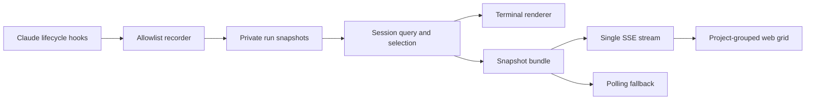

# Session-Aware Streaming Dashboard Design

## Goal

Make the Claudex5 terminal and loopback web dashboards understandable and stable when one machine has multiple Claude Code sessions. Users must be able to select a session by human-readable project and path information, pin that selection, inspect all relevant sessions together, understand what each task does, and see how long work has been running.

The web dashboard will replace one-second browser polling with Server-Sent Events (SSE), while retaining a slower polling fallback. The feature remains a local, zero-token observability layer and must not store prompts, code, tool output, responses, transcripts, credentials, or other unrestricted hook data.

## User Experience

### Automatic selection and pinning

Both terminal and web dashboards resolve their target once at startup and retain that target until the process exits or the user explicitly changes it in the web selector. Activity in another session must not make a running dashboard switch targets.

Selection follows this priority:

1. `--session-id <id>` pins the validated session identifier.
2. `--all` selects the multi-session view.
3. `--select` always opens the interactive selector.
4. Exactly one running session whose canonical working directory equals the command's current directory is selected automatically.
5. If the current directory has multiple candidates or no candidate, an interactive terminal opens the selector.
6. In a non-interactive environment, an unambiguous current-directory candidate may be selected. Ambiguous selection exits with an actionable error requiring `--session-id` or `--all`.

The default selection is the most natural path for ordinary use: a user working in a project with one active session runs `claudex5 dashboard` or `claudex5 dashboard --web` and sees that session without another prompt.

### Interactive selector

The selector emphasizes recognizable context instead of the opaque session identifier:

```text
Select a Claudex5 session:

  1  ● LIVE   veriloqus_ai / Model training plan
     /srv/veriloqus_ai · updated 18s ago

  2  ✓ DONE   customer-support / API contract repair
     /srv/customer-support · updated 12m ago

  A  All sessions
  Q  Quit

Choice [1]:
```

Each row contains status, project basename, sanitized session title when known, full canonical working directory, and relative last-update time. If no safe session title is available, the selector uses the project name and a short session identifier suffix. The complete identifier remains available in detailed or machine-readable output.

Supported commands are:

```bash
claudex5 sessions
claudex5 sessions --all
claudex5 dashboard --select
claudex5 dashboard --all
claudex5 dashboard --web --select
claudex5 dashboard --web --all
```

`claudex5 sessions` prints every running session and the most recently completed session for each project. `claudex5 sessions --all` prints every retained session. The command is non-interactive and suitable for discovering a target to pass through `--session-id`.

`--session-id`, `--all`, and `--select` are mutually exclusive. Invalid or missing identifiers produce a fixed error that does not reflect unsafe path-like input.

### Task meaning and elapsed time

Task nodes display:

- a sanitized task subject as the primary label;
- an optional sanitized task description of at most 160 Unicode scalar values;
- state and elapsed or final duration;
- role, model, and reasoning effort when known;
- parent and dependency relationships already represented by the graph.

The terminal uses a compact two-line representation when enough width is available:

```text
● Task 5 · Docker smoke test and rollback verification
  Verify image startup, health check, and safe rollback · running 3m 18s
  └─ ● harness-implementer [Claude Sonnet 5 · high] · running 2m 41s
```

At narrow widths, the renderer keeps the subject, state, and duration and clips the description first. It never replaces a useful subject with an internal identifier unless no subject is available.

Duration rules are:

- running nodes: `now - started_at`, updated every second in the view;
- waiting nodes: `now - created_at`, shown as waiting time;
- terminal nodes: `finished_at - started_at`, fixed after completion;
- terminal nodes that never had a recorded start: `finished_at - created_at` only when this is an honest lifecycle duration;
- missing or invalid timestamps: `duration unknown` rather than a fabricated value.

The renderer accepts or obtains the current time at render time. Elapsed display is derived and is never written to the event log every second.

### All-sessions terminal view

`claudex5 dashboard --all` groups output by canonical project path. It includes:

- every running session;
- the most recently completed session for each project;
- project path, session title or fallback name, status, progress, updated time;
- currently running nodes with their subjects and elapsed times.

The terminal does not attempt to draw every full graph from seven days of history. Users use `claudex5 sessions --all` to discover any retained completed session and then pin it with `--session-id`.

### All-sessions web view

The selected layout is a project-grouped responsive grid:

- canonical project paths form sections;
- all running sessions are expanded as compact graph cards;
- completed sessions are collapsed under a per-project `Recent completed` control;
- expanding that control exposes all completed sessions still retained locally;
- clicking a session card opens its full graph in the same page;
- `Back to all sessions` restores the grid and its prior scroll position;
- a persistent selector can switch between all sessions and any individual retained session without restarting the server.

Compact cards show the session title, project, state, progress, last update, running duration, and a reduced execution map. The reduced map preserves current work and immediate dependency context. The focused view shows the complete graph. Task descriptions appear as up to two lines in compact cards and in a full detail area or accessible tooltip in the focused graph.

Existing task cards will be reduced from their current size. Exact geometry is an implementation detail tested visually across representative viewport widths, but the compact view must retain readable subject, state, model, and elapsed time.

## Architecture

The implementation adds a shared selection and presentation layer rather than allowing terminal and web code to implement different discovery rules.



### Session query and selection

`scripts/live_graph/store.py` will expose deterministic enumeration rather than requiring callers to iterate private storage directly. The query result is sorted by:

1. running before terminal;
2. most recently updated first;
3. session identifier as a stable final tie-breaker.

Canonical working-directory equality defines project membership. Display names never define identity.

A focused helper module or a small, clearly bounded section of the CLI will own:

- candidate filtering for the current path;
- the default/explicit/all selection state;
- interactive selector rendering and input validation;
- project grouping and recent-completed policy;
- a JSON-safe bundle contract shared by terminal and web consumers.

The selector returns a typed logical choice: one validated session identifier or the `all` sentinel. It does not return a filesystem path.

### Snapshot bundle

The single-session bundle contains its selected snapshot and selection metadata. The all-sessions bundle contains project groups with running and completed snapshots. It contains only the same allowlisted lifecycle data already available to the local dashboard.

Each bundle carries a deterministic revision derived from included session identifiers, schema versions, sequence numbers, and update timestamps. The revision allows the SSE server to suppress duplicate data without hashing or comparing secret-bearing input.

### Server-Sent Events

The browser opens one `EventSource` connection to a fixed local endpoint. The endpoint sends:

- an initial `snapshot` event immediately;
- another `snapshot` event only when the selected bundle revision changes;
- a comment keepalive on an idle interval so intermediaries and the browser can detect a dead connection.

The server may check private snapshot revisions at a short bounded interval because independent hook processes write the files. Browser traffic is event-driven: unchanged snapshots are not sent repeatedly.

The browser updates elapsed-time text locally once per second between snapshot events. This does not alter node state or claim progress that was not observed.

When the SSE connection fails:

1. retain the last known graph;
2. show `RECONNECTING` rather than clearing the view;
3. allow the browser's `EventSource` reconnection behavior;
4. after a bounded failure window or when `EventSource` is unavailable, start five-second snapshot polling;
5. periodically retry SSE and stop polling after the stream is healthy again.

Only one transport is considered authoritative at a time so late polling responses cannot overwrite a newer SSE bundle.

### Dynamic web selection

The web process is not restarted when the user changes selection. Selection is passed as a validated logical query to fixed local endpoints. The server rejects unknown identifiers and never resolves user input as a path.

Changing selection closes the old stream, creates one new stream for the chosen target, and applies an initial bundle before changing the visible selection. A failed selection preserves the previous working view and displays a concise error.

## Claude Code Event Collection

### Current official task hooks

Current Claude Code versions expose `TaskCreated` and `TaskCompleted` lifecycle hooks with stable fields:

- `task_id`;
- `task_subject`;
- optional `task_description`;
- optional `teammate_name`.

The installer adds namespaced Claudex5 command hooks for these events without changing foreign hooks. These stable events become the preferred task identity source.

`TaskCreated` creates a waiting task node with its stable ID, subject, sanitized description, and creation time. `TaskCompleted` updates the same node and preserves or fills missing safe metadata. The recorder ignores deprecated team names for identity.

### Compatibility hooks

The existing `PreToolUse:TaskCreate` and `PostToolUse:TaskUpdate` collectors remain for older Claude Code releases and environments that do not emit the official task lifecycle events.

Compatibility behavior is conservative:

- stable task IDs always win over tool-use IDs;
- duplicate observations of the same stable task update one node idempotently;
- an uncorrelated temporary compatibility node is hidden from presentation after a stable equivalent is observed when safe matching is unique;
- ambiguous title matching never merges nodes;
- old snapshots remain readable without migration or rewriting event history.

The implementation should prefer direct stable identifiers available in tool responses. It must not read transcript files or prompts to infer a relationship.

### Subagent descriptions

`SubagentStart` itself exposes agent identifier and type but not the task description. A separate allowlisted `PreToolUse`/`PostToolUse` observation of the Claude `Agent` tool may provide a short `description` and returned `agentId` suitable for correlation. This enhancement is allowed only when correlation uses an explicit agent ID from structured tool data.

The recorder may persist the sanitized short agent description, but never its `prompt`, response text, output file, transcript path, command, or unrestricted telemetry. If explicit correlation is unavailable, the dashboard displays the agent role without guessing its task.

## Data Model

Existing snapshot schema fields remain readable. New optional fields are:

- run `title`: sanitized session title;
- node `description`: sanitized 160-character task or agent description;
- node `created_at`: first observed creation time, including waiting tasks;
- node `started_at`: first observed transition to running;
- node `finished_at`: first observed terminal transition;
- node `superseded_by`: an optional validated node identifier used only for conservative compatibility-node presentation suppression.

Reducers preserve the first valid lifecycle timestamp and remain idempotent under duplicate hooks. A terminal state never returns to running. Presentation code ignores a superseded compatibility node but event history stays append-only.

Changing the stored schema version is required only if the representation becomes incompatible. Optional fields can be introduced without invalidating version-1 snapshots; the implementation plan must confirm this against reducer recovery tests before deciding whether to increment the schema.

## Privacy and Security

New stored text is deliberately narrow:

- `session_title`: maximum 120 characters;
- `task_subject`: maximum 120 characters;
- `task_description`: maximum 160 characters;
- correlated Agent-tool `description`: maximum 160 characters.

All values pass the existing one-line normalization and secret-pattern redaction before persistence. Nested or non-string values are rejected rather than serialized. A value matching a bearer token, OpenAI or Anthropic-style key, GitHub token, AWS key, private-key header, or credential-bearing URL is replaced with `[REDACTED]`.

The recorder continues to reject:

- prompts and Agent-tool `prompt` values;
- code and diffs;
- commands and unrestricted tool input;
- tool output and subagent final messages;
- transcript and output-file paths;
- environment variables and credentials;
- arbitrary nested payload data.

The web service retains its loopback-only binding, validated `Host` header, no-CORS response policy, restrictive Content Security Policy, no-store caching, and fixed non-reflective errors. These checks run before storage access for the HTML, asset, JSON, and SSE routes.

SSE requests use only fixed paths and validated logical selection values. Response writes handle disconnects without logging request contents or turning an observability error into a Claude workflow failure.

Runtime state remains mode `0700` for directories and `0600` for files. It remains outside the repository and is never included by install, update, backup-export, or Git operations. `.superpowers/` is ignored because the visual design companion stores local mockups there.

## Error Handling

- No sessions: interactive commands show an empty-state explanation; `--once` exits successfully with the existing empty-state text unless an explicit nonexistent identifier was requested.
- Explicit missing session: fixed non-zero error naming only a validated identifier.
- Ambiguous non-interactive selection: exit code 2 with instructions to use `--session-id` or `--all`.
- Invalid selector input: re-prompt without changing the selected session.
- End-of-input or `Q`: exit without starting a dashboard.
- Snapshot read contention or temporary corruption: retain the last valid displayed bundle and mark the connection degraded.
- SSE client disconnect: close that handler cleanly without affecting other clients.
- SSE unavailable: use bounded five-second polling and keep retrying the stream.
- Web selection failure: keep the prior view and show an error.
- Invalid timestamps: show `duration unknown` and continue rendering.
- Hook failures: remain non-blocking and never echo input.

## Installation and Compatibility

The installer and updater merge the two official task-event hook groups and any explicitly required Agent-tool matcher into existing Claude settings. Repeated installation is idempotent. Uninstallation removes only exact Claudex5-owned objects. Existing Orca, Superpowers, official Codex plugin, status-line, and other foreign hook configuration remains unchanged.

The verifier checks exact-once ownership for every installed hook and confirms that legacy compatibility hooks remain installed. Machines with an older Claude Code version continue to collect the legacy subset; verification reports the feature limitation without breaking installation when the current version cannot emit the newer task lifecycle events.

Existing retained snapshots render with fallbacks. The update does not delete, rewrite, or export them.

## Testing and Verification

Implementation follows test-driven development with an observed failing test before each production change.

Automated coverage includes:

1. deterministic session enumeration, project grouping, and ordering;
2. selection priority, mutual-exclusion validation, interactive choices, quit behavior, and non-interactive ambiguity;
3. startup pinning so unrelated session updates cannot switch a dashboard;
4. `sessions`, `sessions --all`, `dashboard --select`, and `dashboard --all` output;
5. running-all plus per-project recent-completed terminal policy;
6. `TaskCreated` and `TaskCompleted` normalization with stable IDs;
7. legacy task-hook compatibility, unique correlation, ambiguous non-merging, and presentation suppression;
8. allowlisted task and agent descriptions, length limits, control-character cleanup, and synthetic secret redaction;
9. proof that prompts, commands, tool outputs, responses, and transcript paths never reach event or snapshot files;
10. created, started, and finished timestamp idempotency;
11. waiting, running, terminal, and unknown elapsed-time formatting with an injected clock;
12. terminal wide and narrow layouts with meaningful labels;
13. single-session and all-session snapshot bundle revisions;
14. SSE initial events, changed-only events, keepalive, clean disconnect, and multiple clients;
15. browser SSE reconnection, polling fallback, transport ordering, and recovery;
16. project-grouped responsive grid, collapsed completed sections, focused-card navigation, and restored scroll position;
17. compact cards and accessible full task descriptions at representative viewport sizes;
18. rejection of foreign `Host` headers and invalid or path-like session selection before storage access;
19. installer, verifier, updater, and failure-atomic uninstaller behavior with existing foreign hooks;
20. backward rendering of current stored snapshot fixtures.

Final verification runs the complete Python suite, shell installer tests, strict verifier, syntax checks for embedded JavaScript, repository secret scans, diff checks, and real-browser interaction at desktop and narrow viewport sizes. An independent normal review and a separate failure-oriented review run in fresh read-only contexts before integration is offered.

## Rollout and Rollback

Work occurs on `agent/session-aware-streaming-dashboard`. The main branch remains unchanged until the user explicitly requests integration.

After installation, new Claude sessions use the added hooks. Existing in-progress sessions may require restart or resume before the newly merged hook configuration is active. Runtime history is preserved across updates and uninstall by default.

Before integration, rollback is `git switch main`. After integration, the repository's failure-atomic uninstaller removes owned hooks and command links without deleting private dashboard history. Existing installer backups remain the configuration recovery mechanism.
